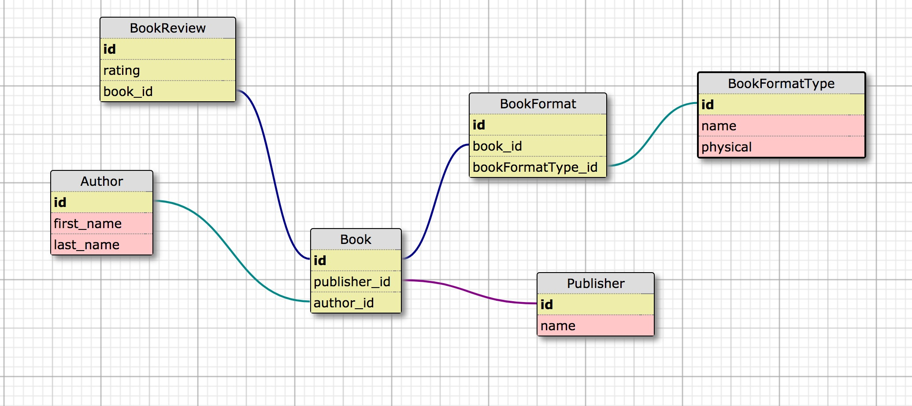

# README

## Notes on this project

The process of writing code is just as important as the code actually written. (I.E. the right code for the wrong solution is still bad code) so, were I working for Terakeet, step one would be to make sure I fully understand the problem space.

Some of the questions that would spring to mind are, if I were handed this spec:
- Who would be using this tool? Terakeet's customers or employees?
- Can I have access to some of the conversation around this new feature, so I can load up on the context?
- What sort of sad paths should I build? Should it fail "silently and gracefully", or perhaps in a more verbose but ugly way? (I'll just design my own sad paths for now)

This is the schema I put together, based on the instructions:

I'll be writing just the `book` model, but I would obviously have lots of room to explore and define the relationships between existing models in the codebase and the new one I was working on. Unless instructed otherwise, I'd drop in a few unit and feature tests that pass before I even started writing new code. Those would help serve as guardrails to make sure I didn't cause problems elsewhere. I'd timebox this "guardrail code" to just an hour or so, though. A small investment.

### step 1

Obviously the `Book::search()` will be the more interesting method, but to get there, and get there well, I'd like to have the model well-defined, as well as some factories set up that tests all aspects of the relationships.
